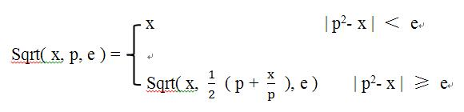

# 【大学递归】求解平方根

## 题目描述

小明上来大学，学习了用求解平方根的迭代公式。



其中：p 为 x 的近似平方根，e 是结果允许的误差。

**输入：x, e**

**输出：p** 保留小数点后 8 位。

## 样例

### 样例1

#### Input

```
4
1e-8
```

#### Output

```
2.00000000
```

### 样例2

#### Input

```
0.25
1e-8
```

#### Output

```
0.50000000
```

