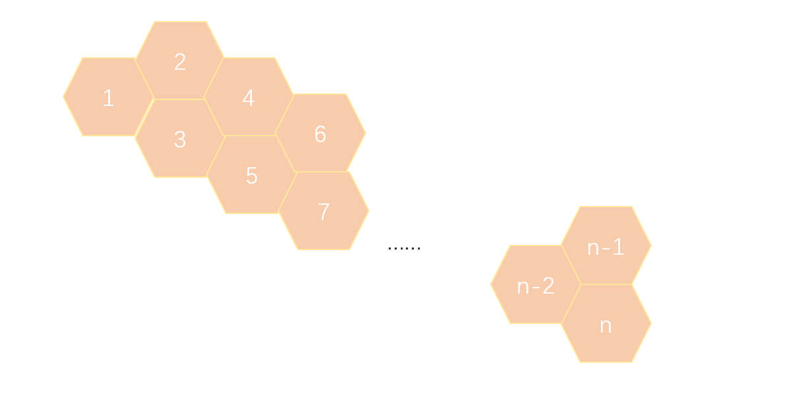

# 小蜜蜂

## 题目描述

一只小蜜蜂在如下图所示的蜂窝上爬行。它爬行时，只能从一个格爬到相邻的大号格子中。例如，从 1 号格子可以爬到 2 号或者 3 号格子，从 2 号则可以爬到 3 号或者 4 号格子。



  请问从一个格子 a 爬到一个格子 b 一共有多少种可行的路线。

### 输入：

  分别是起始点 a 和终止点 b 的编号。（ a 和 b 在 1~100 之间，且 a<b 。）

### 输出：

  方案数量。

## 样例

### 样例1

#### Input

```
1 4
```

#### Output

```
3
```

### 样例2

#### Input

```
1 5
```

#### Output

```
5
```

### 样例3

#### Input

```
1 50
```

#### Output

```
12586269025
```

### 样例4

#### Input

```
2 50
```

#### Output

```
7778742049
```

### 样例5

#### Input

```
1 100
```

#### Output

```
354224848179261915075
```

