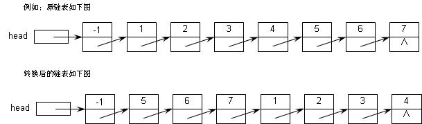

# 链表移动

## 题目描述

编写一个函数，将给定的带有头结点的单向链表的前m个节点移到链尾。
  结构的定义：
struct node
{ int num;
       struct node *next;
}
函数的原型：struct node *monenode( struct node *head,int m )， 其中：参数head 是单向链表的头指针；参数m 是要移动的节点数。函数的返回值是单向链表的头指针。
例如当m=4时：



### 预设代码：

```c
/* PRESET CODE BEGIN - NEVER TOUCH CODE BELOW */

#include <stdio.h>
#include <stdlib.h>
typedef struct numLink
{
	int no;
	struct numLink *next;
}NODE;

NODE *monenode( NODE *head, int m );

void SetLink( NODE *h, int n )
{
	NODE *p=NULL, *q=NULL;
	int i;
	for( i=0; i<n; i++)
	{
		p = (NODE *)malloc(sizeof(NODE));
		p->no = i+1;
		p->next = NULL;
		if( h->next == NULL )
		{
			h->next = p;
			q = p;
		}
		else
		{
			q->next = p;
			q = q->next;
		}
	}
	return;
}

int main( )
{
	int n,m;
	NODE *head=NULL, *q=NULL;
	scanf("%d%d",&n,&m);
	head = (NODE *)malloc(sizeof(NODE));
	head->no = -1;
	head->next = NULL;

	SetLink( head, n );

	q = monenode( head, m );

	do
	{
		printf("%d ",q->next->no);
		q = q->next;
	}while( q->next != NULL ); 
	printf("\n");
	return 0;
}

/* PRESET CODE END - NEVER TOUCH CODE ABOVE */
```


## 样例

### 样例1

#### Input

```
7 4
```

#### Output

```
5 6 7 1 2 3 4 
```
